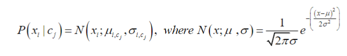
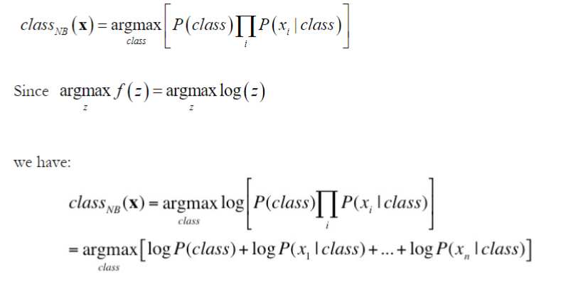

## Gaussian Naive Bayews Classifier

#ML assignment - #2 Summer 2024

- **step 1:** create training and test set of about 2300 instances, each should have 40% spam, 60% not spam. Unnescerry to stanard featrures assuming each feature is independent.

- **step 2:** Create probablistic model.
> - compute probality for each class, 1 (spam) and 0(not spam) in the training data P(1) should be about 0.4
> - For each of the 57 features compute the mean and standard diviation in the training set of values given for each class in the training set. If asny feature has zero standard deviation assign it a minimal std dev. (eg 0.0001) to avoid divide by zero errors.

- **Step 3:** Run naive Bayes on the test data.

#TODO: add formulas from the assignment description.
 
 ##Assignment:
##Assignment
1. Create training and test data set
   
   
   
2. Create probalistic Model
 -   compute prior probility for each class (1=spam, 0=not spam)
 -   for each of the 57 features compute the mean and standard deviation values
     in the training set given each class. (minimal standard deviation = 0.0001)

3. Run Naive Bayes on the test data
 -   Using Gaussian Naive Bayes algorithm
 

Gaussian Navie Bayes Algorithm

Classification method

dataset source: https://archive.ics.uci.edu/dataset/94/spambase